# ResolveAI-Agentic-LLM-Customer-Support-System
Built an end-to-end agentic LLM pipeline (classify → RAG draft → human approve) using Gemini API, achieving ~97% ticket classification accuracy across 8+ tested support categories. • Implemented SQLite FTS5 KB retrieval (top-3 articles/ticket, ~35% latency reduction), 5-state ticket machine, dual role-guarded portals
# ResolveAI

**Agentic customer support with dual portals — Customer & Agent**  
Streamlit · FastAPI · SQLite · Google Gemini · JWT Auth

[Architecture](#-architecture) · [Ticket Flow](#-ticket-lifecycle) · [Auth](#-authentication) · [Database](#-database-schema) · [API](#-api-reference) · [Setup](#-getting-started)

---

## Overview

**ResolveAI** routes support work through an AI pipeline (classify → RAG draft → human approve) while keeping **customers** and **agents** in separate, role-guarded experiences.


| Portal       | Who        | Can do                                                                              |
| ------------ | ---------- | ----------------------------------------------------------------------------------- |
| **Customer** | End users  | Register/login (email or Google), submit tickets, view **approved** agent responses |
| **Agent**    | Staff only | Dashboard metrics, approve/edit drafts, KB management, agent logs, delete/reprocess |


**Local URLs**


| Service      | URL                                                      |
| ------------ | -------------------------------------------------------- |
| Streamlit UI | [http://localhost:8501](http://localhost:8501)           |
| FastAPI      | [http://localhost:8000](http://localhost:8000)           |
| OpenAPI docs | [http://localhost:8000/docs](http://localhost:8000/docs) |


---

## Architecture

### System context

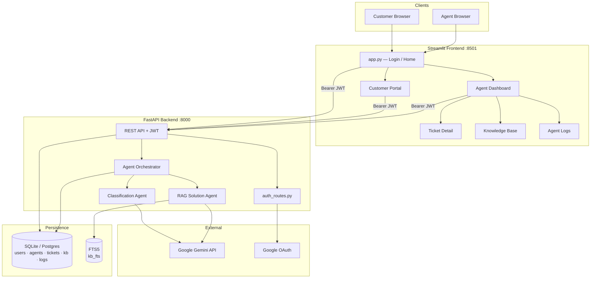


### Layered design

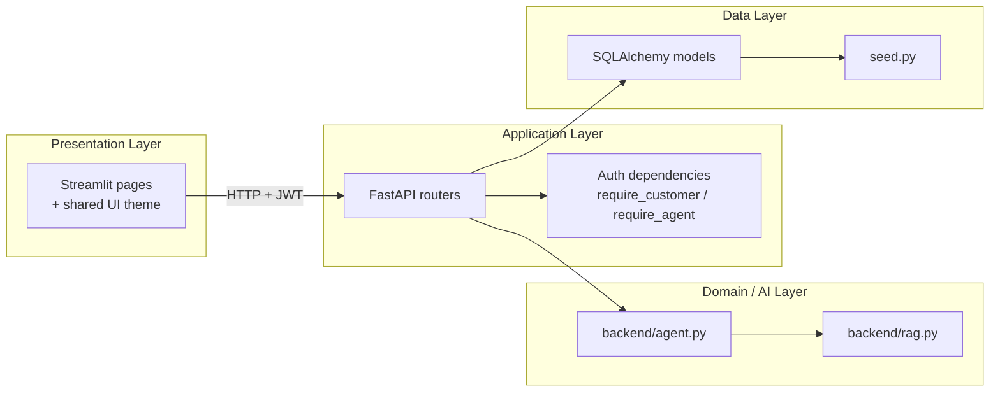


### Dual-portal navigation

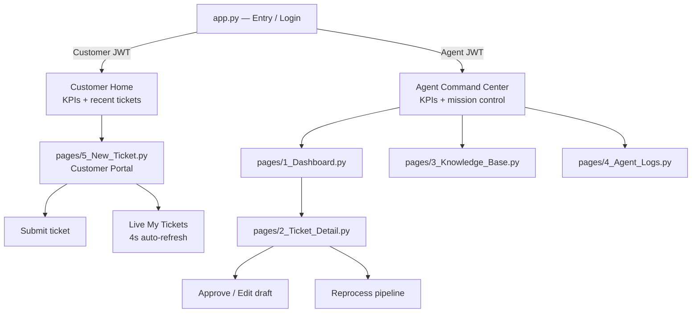


---

## Ticket lifecycle

### Status state machine

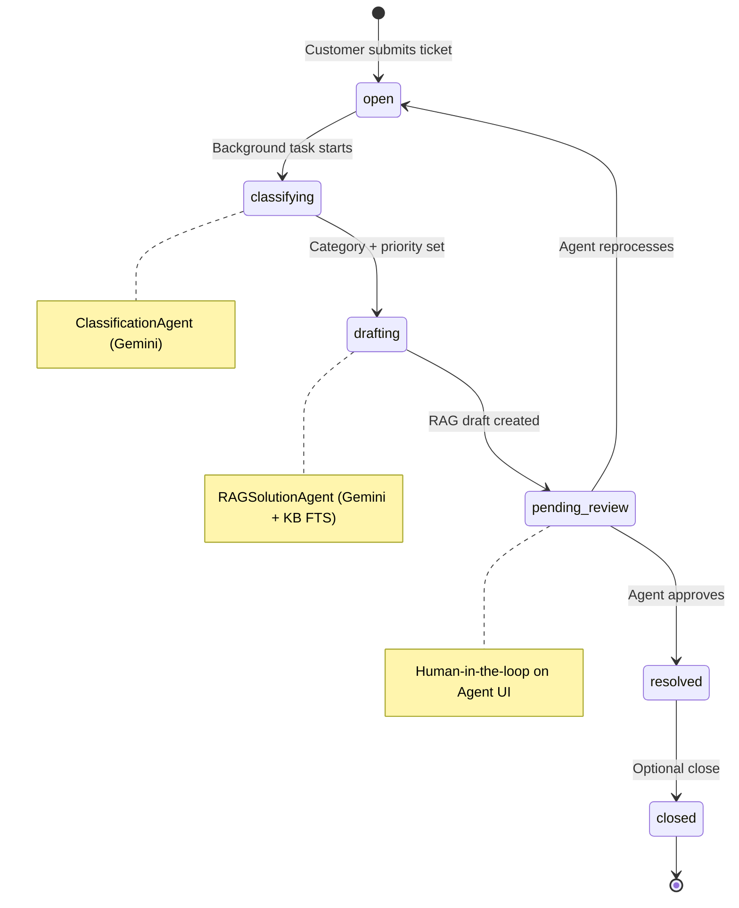


### End-to-end sequence (one ticket)

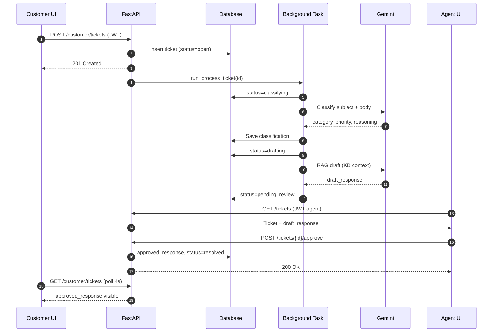


---

## Authentication

All protected routes use **JWT Bearer** tokens. Roles: `customer` | `agent`.

### Customer — email/password

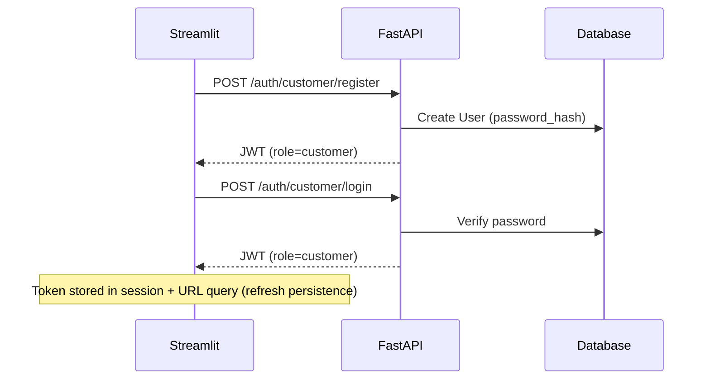


### Customer — Google OAuth

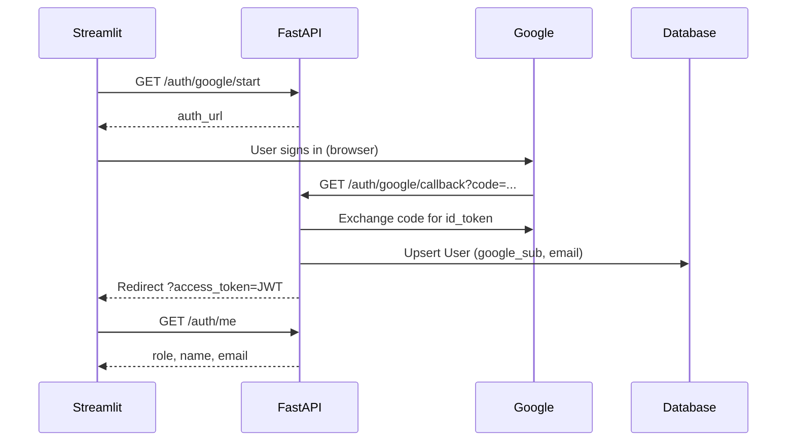


### Agent — staff login

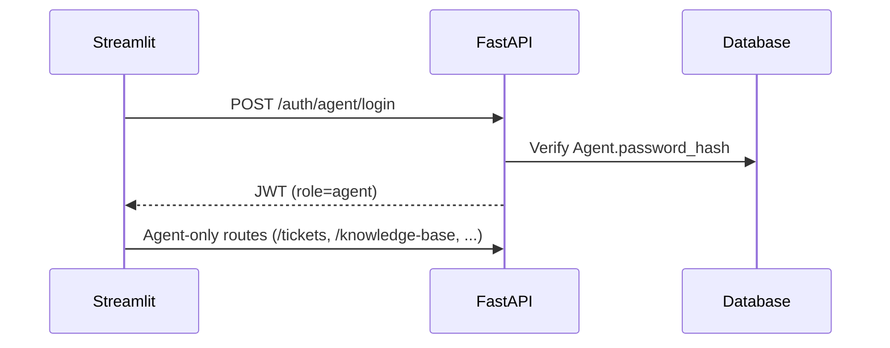


### Access control matrix


| Resource                     | Customer | Agent |
| ---------------------------- | -------- | ----- |
| `POST /customer/tickets`     | ✅        | ❌     |
| `GET /customer/tickets`      | ✅ own    | ❌     |
| `GET /tickets` (full)        | ❌        | ✅     |
| `POST /tickets/{id}/approve` | ❌        | ✅     |
| `GET /knowledge-base`        | ❌        | ✅     |
| `GET /logs/recent`           | ❌        | ✅     |
| `DELETE /tickets/{id}`       | ❌        | ✅     |


---

## Database schema

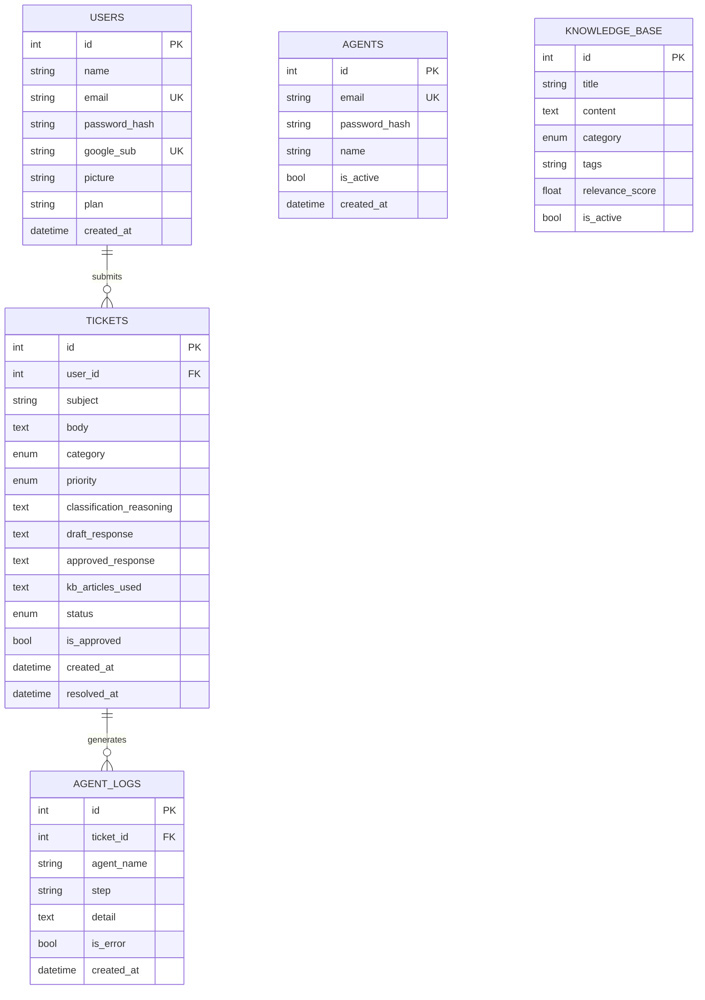


**FTS5:** `kb_fts` virtual table mirrors `knowledge_base` for fast RAG retrieval (see `backend/database.py`).

---

## Live updates (no manual refresh)

Customer views poll the API every **4 seconds** via Streamlit `@st.fragment(run_every=...)`.

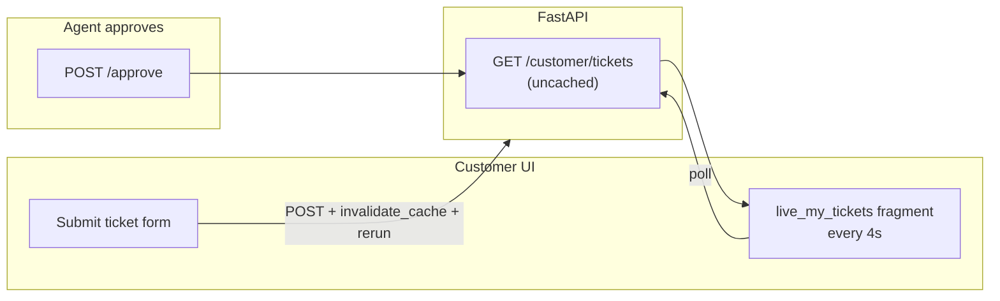


---

## Tech stack


| Layer      | Technology                                        |
| ---------- | ------------------------------------------------- |
| UI         | [Streamlit](https://streamlit.io)                 |
| API        | [FastAPI](https://fastapi.tiangolo.com) + Uvicorn |
| ORM        | SQLAlchemy 2                                      |
| DB (local) | SQLite + WAL                                      |
| DB (prod)  | Postgres recommended                              |
| LLM        | Google Gemini (`GEMINI_MODEL`)                    |
| Auth       | JWT (python-jose) + passlib (pbkdf2_sha256)       |
| OAuth      | Google OAuth 2.0                                  |
| KB search  | SQLite FTS5                                       |


---

## Project structure

```text
Project/
├── backend/
│   ├── server.py          # FastAPI app + route guards
│   ├── auth.py            # JWT, password hashing, Google verify
│   ├── auth_routes.py     # /auth/* login & OAuth
│   ├── agent.py           # Gemini orchestration pipeline
│   ├── rag.py             # Knowledge retrieval
│   ├── models.py          # SQLAlchemy entities
│   ├── schemas.py         # Pydantic request/response models
│   ├── database.py        # Engine, migrations, FTS5
│   └── seed.py            # Default agent + demo KB
├── frontend/
│   ├── app.py             # Login + Customer/Agent home
│   ├── pages/
│   │   ├── 1_Dashboard.py
│   │   ├── 2_Ticket_Detail.py
│   │   ├── 3_Knowledge_Base.py
│   │   ├── 4_Agent_Logs.py
│   │   └── 5_New_Ticket.py    # Customer Portal
│   ├── utils/
│   │   ├── ui.py          # Theme, sidebar, API helpers
│   │   └── auth.py        # Session + JWT persistence
│   └── styles/main.css
├── data/                  # SQLite file (gitignored)
├── .env.example
├── requirements.txt
└── run.ps1
```

---

## API reference

### Health


| Method | Path      | Auth   |
| ------ | --------- | ------ |
| `GET`  | `/health` | Public |


### Authentication


| Method | Path                      | Description                        |
| ------ | ------------------------- | ---------------------------------- |
| `GET`  | `/auth/google/start`      | OAuth URL for Google sign-in       |
| `GET`  | `/auth/google/callback`   | OAuth callback → redirect with JWT |
| `POST` | `/auth/google`            | Sign in with Google ID token       |
| `POST` | `/auth/customer/register` | Email/password registration        |
| `POST` | `/auth/customer/login`    | Email/password login               |
| `POST` | `/auth/agent/login`       | Staff login                        |
| `GET`  | `/auth/me`                | Current user from JWT              |


### Customer (JWT `role=customer`)


| Method | Path                | Description                         |
| ------ | ------------------- | ----------------------------------- |
| `POST` | `/customer/tickets` | Create ticket → starts AI pipeline  |
| `GET`  | `/customer/tickets` | List own tickets (sanitized fields) |


### Agent (JWT `role=agent`)


| Method   | Path                      | Description               |
| -------- | ------------------------- | ------------------------- |
| `GET`    | `/tickets`                | List/filter tickets       |
| `GET`    | `/tickets/{id}`           | Full ticket detail        |
| `PATCH`  | `/tickets/{id}`           | Update ticket             |
| `DELETE` | `/tickets/{id}`           | Delete ticket             |
| `POST`   | `/tickets/{id}/approve`   | Approve draft → resolved  |
| `POST`   | `/tickets/{id}/reprocess` | Re-run AI pipeline        |
| `GET`    | `/tickets/{id}/logs`      | Per-ticket agent logs     |
| `GET`    | `/logs/recent`            | Recent orchestration logs |
| `GET`    | `/knowledge-base`         | List KB articles          |
| `POST`   | `/knowledge-base`         | Create article            |
| `DELETE` | `/knowledge-base/{id}`    | Soft-delete article       |


---

## Getting started

### 1) Install

```bash
git clone <your-repo-url>
cd Project
pip install -r requirements.txt
```

### 2) Environment

```bash
cp .env.example .env
```


| Variable               | Required | Description                                  |
| ---------------------- | -------- | -------------------------------------------- |
| `GEMINI_API_KEY`       | ✅        | Google AI API key                            |
| `GEMINI_MODEL`         | ✅        | e.g. `gemini-2.5-flash`                      |
| `API_BASE_URL`         | ✅        | `http://localhost:8000`                      |
| `DATABASE_URL`         | ✅        | `sqlite:///./data/support.db`                |
| `JWT_SECRET`           | ✅        | Long random string                           |
| `AGENT_EMAIL`          | ✅        | Default staff email                          |
| `AGENT_PASSWORD`       | ✅        | Default staff password                       |
| `GOOGLE_CLIENT_ID`     | OAuth    | Google OAuth client                          |
| `GOOGLE_CLIENT_SECRET` | OAuth    | Google OAuth secret                          |
| `GOOGLE_REDIRECT_URI`  | OAuth    | `http://localhost:8000/auth/google/callback` |
| `STREAMLIT_URL`        | OAuth    | `http://localhost:8501`                      |


> Never commit `.env`. Rotate secrets if exposed.

### 3) Run locally

**Terminal A — API**

```bash
uvicorn backend.server:app --host 0.0.0.0 --port 8000 --reload
```

**Terminal B — UI**

```bash
streamlit run frontend/app.py --server.port 8501
```

**Windows shortcut**

```powershell
.\run.ps1
```

### Default logins


| Role     | Credentials                                   |
| -------- | --------------------------------------------- |
| Agent    | `AGENT_EMAIL` / `AGENT_PASSWORD` from `.env`  |
| Customer | Register on Home → **Email Login → Register** |


---

## Google OAuth setup

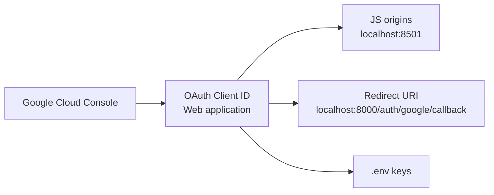


1. **APIs & Services → Credentials → Create OAuth Client ID** (Web application).
2. **Authorized JavaScript origins:** `http://localhost:8501`
3. **Authorized redirect URIs:** `http://localhost:8000/auth/google/callback`
4. Add **test users** while app is in *Testing* publishing status.
5. Copy Client ID/Secret to `.env`.

**Error: `Token used too early`** — sync system clock (Windows: Settings → Time & language → Sync now).

---

## Deployment architecture (free tier)

> **Vercel** hosts Node/static frontends well; it does **not** run Streamlit + long-lived FastAPI Python servers natively. Use the layout below for a free-ish stack.

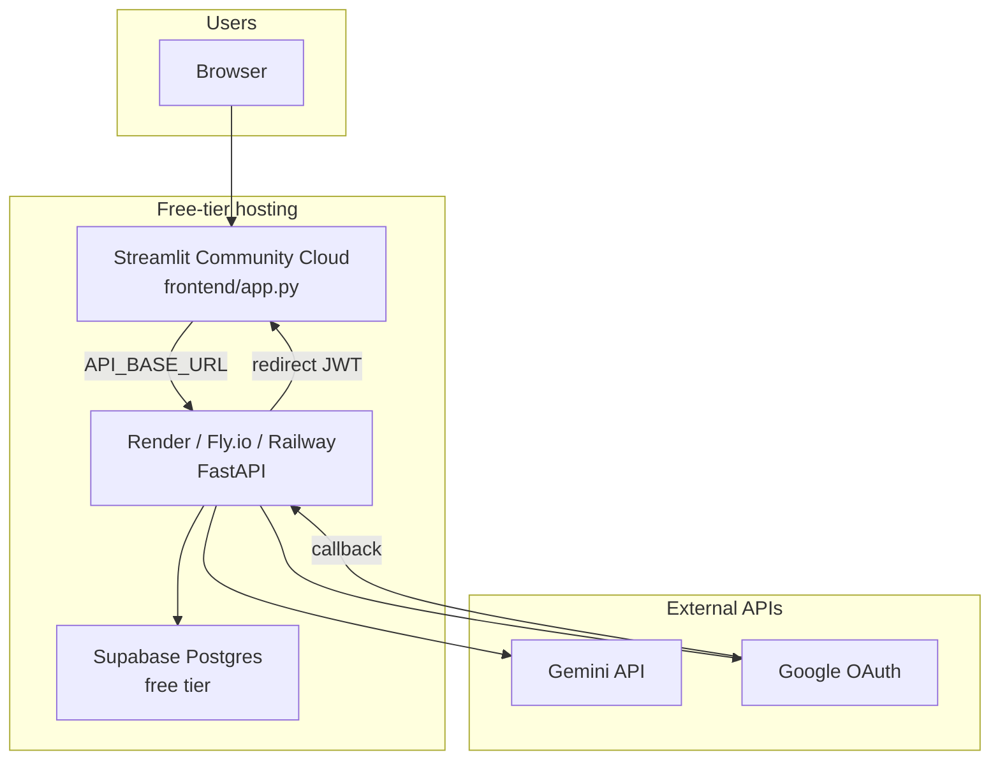


| Component    | Suggested free host     | Notes                       |
| ------------ | ----------------------- | --------------------------- |
| Streamlit UI | Streamlit Cloud         | Set secrets = `.env` values |
| FastAPI      | Render free web service | May sleep when idle         |
| Database     | Supabase Postgres       | Replace `DATABASE_URL`      |
| Gemini       | Google AI Studio        | API key in secrets          |


**Production checklist**

- Move from SQLite → Postgres
- Set strong `JWT_SECRET`
- Update Google OAuth URLs to production domains
- Store tokens in **httpOnly cookies** (not URL query) for production
- Enable HTTPS everywhere

---

## Troubleshooting


| Symptom                      | Likely cause                  | Fix                                                           |
| ---------------------------- | ----------------------------- | ------------------------------------------------------------- |
| Logged out on refresh        | Session cleared               | Re-login; token persists via URL query locally                |
| `google_exchange_failed`     | Clock skew / OAuth mismatch   | Sync time; verify redirect URI                                |
| `Invalid agent credentials`  | Wrong `.env` vs DB seed       | Use `AGENT_EMAIL` / `AGENT_PASSWORD` from `.env`; restart API |
| Backend won't start (bcrypt) | passlib/bcrypt on Python 3.14 | Project uses `pbkdf2_sha256`                                  |
| Tickets don't update live    | Fragment not running          | Stay on Customer Portal; wait ~4s                             |
| Gemini 503                   | Missing `GEMINI_API_KEY`      | Add to `.env`, restart API                                    |


---


---

Built with Streamlit + FastAPI + Gemini · ResolveAI
